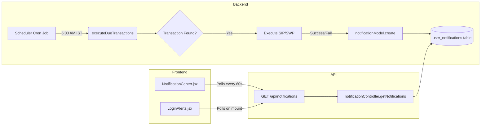

# Deep Analysis: Notification System End-to-End

**Date:** 2026-02-01
**Status:** Analysis Complete
**Objective:** Determine why users are not seeing notifications when SIP/SWP executes.

---

## 1. System Architecture Overview



---

## 2. Backend Analysis

### 2.1 Scheduler Trigger
**File:** [scheduler.job.js](file:///c:/Users/shashidhar/Desktop/MF-Investments/src/jobs/scheduler.job.js#L84)
-   **Schedule:** `'0 6 * * *'` with `timezone: 'Asia/Kolkata'`
-   **Action:** Calls `schedulerService.executeDueTransactions(today)`

### 2.2 Notification Creation
**File:** [scheduler.service.js](file:///c:/Users/shashidhar/Desktop/MF-Investments/src/services/scheduler.service.js#L248-L291)

| Trigger | Code Line | Title | Type |
|---------|-----------|-------|------|
| SWP Success | L249 | `Passive Income Alert! 🎉` | SUCCESS |
| SIP Success | L256 | `Wealth Builder Alert 🚀` | SUCCESS |
| Any Failure | L286 | `Action Needed ⚠️` or `SWP Paused ⚠️` | ERROR |

### 2.3 Route Registration
**File:** [app.js](file:///c:/Users/shashidhar/Desktop/MF-Investments/src/app.js#L101)
```javascript
app.use('/api/notifications', notificationRoutes);
```
✅ **Correctly Registered.**

---

## 3. Frontend Analysis

### 3.1 Component: NotificationCenter.jsx
**Location:** [NotificationCenter.jsx](file:///c:/Users/shashidhar/Desktop/MF-Investments/client/src/components/NotificationCenter.jsx)
**Mount Point:** [Layout.jsx](file:///c:/Users/shashidhar/Desktop/MF-Investments/client/src/components/Layout.jsx#L84) - In the header, visible on all authenticated pages.

| Feature | Status |
|---------|--------|
| Bell Icon | ✅ Renders correctly |
| Polling | ✅ Every 60 seconds |
| Badge | ✅ Shows `unreadCount` |
| Dropdown | ✅ Lists notifications |

### 3.2 Component: LoginAlerts.jsx
**Location:** [LoginAlerts.jsx](file:///c:/Users/shashidhar/Desktop/MF-Investments/client/src/components/LoginAlerts.jsx)
**Mount Point:** [Portfolio.jsx](file:///c:/Users/shashidhar/Desktop/MF-Investments/client/src/pages/Portfolio.jsx#L1204)

> [!WARNING]
> **LoginAlerts is ONLY mounted on the Portfolio page.**
> If a user logs in and goes to `/browse` or `/invest` first, they will NOT see the modal popup.

---

## 4. Identified Issues

### Issue 1: No Scheduler Logs (CRITICAL)
**Root Cause:** `scheduler.service.js` uses `console.log()` instead of the file-based `logger`.
**Impact:** We cannot verify if the scheduler ran, how many transactions it found, or if it encountered errors.
**Fix:** Replace `console.log` with `logger.info` (as per `PLAN-logging-and-swp.md`).

### Issue 2: LoginAlerts Limited Visibility (MINOR)
**Root Cause:** The modal popup component is only rendered on the Portfolio page.
**Impact:** Users navigating to other pages after login won't see the celebratory popup.
**Fix:** Move `<LoginAlerts />` to `Layout.jsx` (inside the authenticated check) so it renders on ANY authenticated page.

### Issue 3: Possible Silent Scheduler Failure (UNKNOWN)
**Root Cause:** If the scheduler's DB query (`findDueTransactions`) returns 0 rows because:
    a. `next_execution_date` is in the future, OR
    b. `last_execution_date` already matches today (preventing double execution),
then no notifications are created.
**Impact:** The system works "correctly" but silently, giving the impression of failure.
**Verification Needed:** Query the database to check `next_execution_date` values.

---

## 5. Recommendations

### Immediate Action: Implement Logging Upgrade
Without logs, we are debugging blind. Implement `docs/PLAN-logging-and-swp.md` first.

### Secondary Action: Move LoginAlerts to Layout
```diff
// client/src/components/Layout.jsx
+ import LoginAlerts from './LoginAlerts';

  {isAuthenticated && (
    <>
      <NotificationCenter />
+     <LoginAlerts />
      ...
    </>
  )}
```

### Tertiary Action: Add Scheduler Health Check
Create an Admin Dashboard widget that shows:
- Last run time of "Daily Transaction Scheduler"
- Number of transactions processed
- Next scheduled run time

---

## 6. Conclusion

The notification *code* is correctly implemented. The likely reason for "no notifications" is one of:
1. **Scheduler never executed a transaction** (due dates are in the future).
2. **Scheduler ran but found 0 due transactions** (silent success in logs).
3. **Scheduler encountered an error** (invisible due to `console.log`).

**Next Step:** Implement the logging upgrade to gain visibility.
