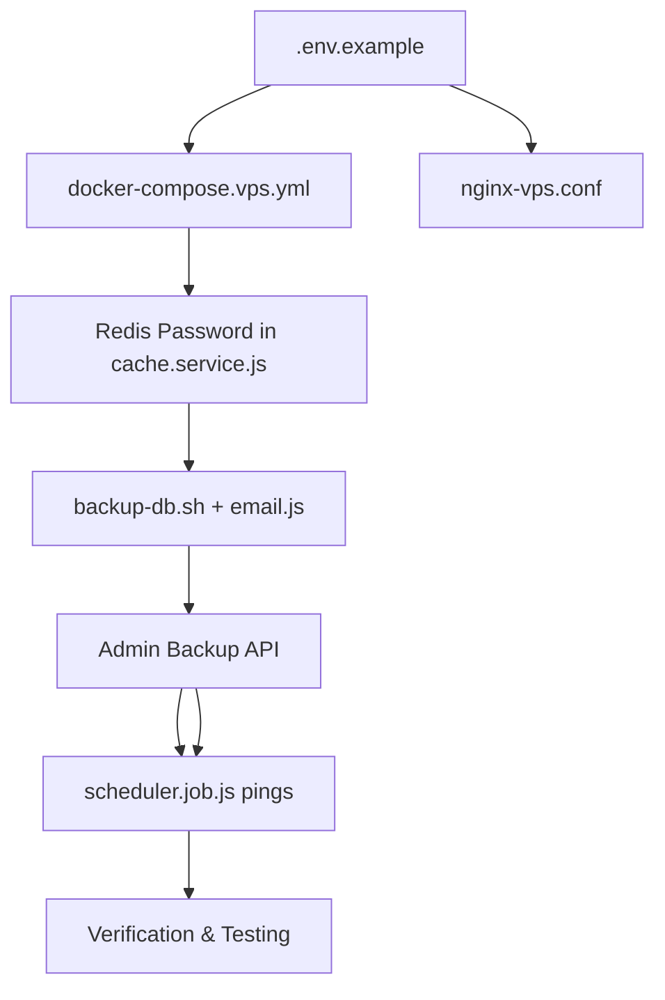

# Plan: VPS Production Hardening (5 Pillars)

> **Scope:** Linux VPS (4 Core, 8GB RAM). Manual `git pull` + `docker compose` deployment.
> **Constraint:** Existing `docker-compose.yml` is for TrueNAS and will **NOT** be modified.

---

## Architecture Overview

```
Internet (HTTPS:443)
    │
    ▼
┌──────────────────────────────────────────────┐
│  Nginx Proxy Manager (NPM)                   │
│  - SSL Termination (Let's Encrypt)            │
│  - Rate Limiting (DDoS basic protection)      │
│  - Proxy → backend:4000                       │
└──────────────────────────────────────────────┘
    │
    ▼
┌──────────────────────────────────────────────┐
│  Backend (Node.js:4000)                       │
│  - Serves API + React SPA                     │
│  - Cron Jobs (Sync, Scheduler)                │
│  - Healthcheck: /api/health                   │
└──────────────────────────────────────────────┘
    │                    │
    ▼                    ▼
┌─────────────┐   ┌─────────────┐
│ MySQL 8.0   │   │ Redis 7     │
│ (Password)  │   │ (Password!) │   ←── NEW: Redis password
│ Port: 3306  │   │ Port: 6379  │
└─────────────┘   └─────────────┘

External Monitoring:
  └── UptimeRobot → pings /api/health every 5 min
  └── Alerts via Email/Telegram if DOWN
```

---

## Pillar 1: MySQL Backup Strategy (CSV/Excel Export)

### Problem
No backup mechanism exists. If the MySQL container or volume is corrupted, all user data, portfolio history, and fund data is permanently lost.

### Solution
A **cron-based backup script** that runs inside Docker, dumps key tables to CSV, and stores them locally.

### Implementation

#### 1.1 [NEW] `scripts/backup-db.sh`
- A shell script that:
  1. Connects to MySQL using `docker compose exec`
  2. Exports critical tables to CSV using `SELECT ... INTO OUTFILE` or `mysql -e "query" > file.csv`
  3. Tables to export:
     - `users` (user accounts)
     - `demo_accounts` (virtual balances)
     - `holdings` (portfolio positions)
     - `transactions` (trade history)
     - `ledger_entries` (financial ledger)
     - `ledger_entries` (financial ledger)
     - `funds` (fund master list)
     - **EXCLUDED:** `fund_nav_history` (Can be re-synced from AMFI)
  4. Creates timestamped folder: `backups/YYYY-MM-DD/`
  5. Compresses to `.tar.gz`
  6. Retains last **7 daily backups** (auto-cleanup)
  7. **Email Delivery:** Sends the `.tar.gz` file to `Shashidhar02april@gmail.com`.
  8. **[NEW] Admin Download:** Admins can browse and download backups from the dashboard.

#### 1.2 [NEW] `scripts/send-backup-email.js`
- A small Node.js script (since we already have Node in the backend container)
- Usage: `node scripts/send-backup-email.js ./backups/daily/2026-02-12.tar.gz`

#### 1.3 [NEW] Admin API & UI
- **Backend:** `GET /api/admin/backups` (list) and `GET /api/admin/backups/:filename` (download)
- **Frontend:** New tab "Backups" in Admin Dashboard to list and download files.
- Restore script that imports CSV files back into MySQL
- Usage: `./scripts/restore-db.sh ./backups/2026-02-12/`

#### 1.3 Cron Schedule (Host-level)
```bash
# Daily at 2:00 AM IST (after all sync jobs complete)
0 2 * * * /opt/mf-fund/scripts/backup-db.sh >> /opt/mf-fund/logs/backup.log 2>&1
```

#### 1.4 Directory Structure
```
backups/
└── daily/
    ├── 2026-02-12.tar.gz    (users, holdings, transactions, ledger)
    ├── 2026-02-11.tar.gz
    └── ... (7 days retained)
```

#### 1.5 Backup Verification
- Script logs row counts after export
- Example log: `[Backup] users: 42 rows | holdings: 156 rows | transactions: 890 rows | Size: 2.3 MB`

---

## Pillar 2: Monitoring (UptimeRobot)

### Problem
No way to know if the app goes down. If Docker restarts at 3 AM and MySQL fails to start, nobody knows until a user complains.

### Solution
Use **UptimeRobot** (free tier: 50 monitors) for uptime monitoring + cron job verification.

### Implementation

#### 2.1 Health Checks to Register

| Check Name | Type | Schedule | Alert Delay |
|------------|------|----------|-------------|
| App Heartbeat | HTTP ping to `/api/health` | Every 5 min | 10 min |
| MySQL Backup | Cron ping after backup script | Daily 2 AM | 30 min |
| Fund Sync | Cron ping after full sync | Daily 1 AM | 60 min |
| AMFI NAV Sync | Cron ping after AMFI sync | Daily 11 PM | 60 min |
| SIP Scheduler | Cron ping after SIP execution | Daily 6 AM | 30 min |

#### 2.2 [MODIFY] `scripts/backup-db.sh`
- At the end of a successful backup, ping the UptimeRobot heartbeat URL:
  ```bash
  curl -fsS --retry 3 https://heartbeat.uptimerobot.com/<BACKUP_MONITOR_KEY> > /dev/null
  ```

#### 2.3 [MODIFY] `src/jobs/scheduler.job.js`
- After each cron job completes, ping the corresponding UptimeRobot heartbeat URL via HTTP
- Add `KUMA_PUSH_FUND_SYNC_URL`, `KUMA_PUSH_AMFI_SYNC_URL`, `KUMA_PUSH_SIP_URL` env vars
- Implementation: Simple `fetch()` call at end of each job's `onComplete` callback

#### 2.4 UptimeRobot HTTP Monitor (App Heartbeat)
- Create an **HTTP(s) Monitor** in UptimeRobot dashboard pointing to `https://www.trymutualfunds.com/api/health`
- Interval: **5 minutes** (free tier default)
- UptimeRobot pings your app externally — **no host-level cron needed**

#### 2.5 Alert Configuration (UptimeRobot Dashboard)
- **Email alerts** → `Shashidhar02april@gmail.com`
- **Telegram/Slack** → Connect via UptimeRobot integrations
- **Grace period**: 10 min for app, 60 min for cron jobs
- Free tier supports Email + Webhooks + Mobile Push

---

## Pillar 3: Nginx Rate Limiting

### Problem
The current `nginx.conf` has **zero rate limiting**. Any bot or attacker can hammer the API with thousands of requests per second, causing MySQL to choke.

### Solution
Add rate limiting zones to the **VPS Nginx config** (not touch TrueNAS version).

### Implementation

#### 3.1 [NEW] `docker/nginx-vps.conf`
New VPS-specific Nginx config (the TrueNAS `nginx.conf` stays untouched):

**Rate Limit Zones to Define:**
```
# Zone 1: General API (20 requests/sec per IP)
limit_req_zone $binary_remote_addr zone=api:10m rate=20r/s;

# Zone 2: Auth endpoints (5 requests/sec per IP — login, register, forgot-password)
limit_req_zone $binary_remote_addr zone=auth:10m rate=5r/s;

# Zone 3: Admin endpoints (2 requests/sec per IP)
limit_req_zone $binary_remote_addr zone=admin:10m rate=2r/s;
```

**Apply to Locations:**

| Location | Zone | Burst | Action on Excess |
|----------|------|-------|-----------------|
| `/api/auth/` | `auth` | burst=10, nodelay | 429 Too Many Requests |
| `/api/admin/` | `admin` | burst=5, nodelay | 429 Too Many Requests |
| `/api/` | `api` | burst=30, nodelay | 429 Too Many Requests |
| `/` (static) | No limit | — | Serve normally |

**Additional Security Headers:**
```
# Block common bots
if ($http_user_agent ~* (bot|crawl|spider|scraper)) {
    return 403;
}

# Limit request body size (prevent large payload attacks)
client_max_body_size 5M;

# Connection limits per IP
limit_conn_zone $binary_remote_addr zone=connlimit:10m;
limit_conn connlimit 50;
```

---

## Pillar 4: Redis Password Protection

### Problem
Current Redis config: `redis-server --appendonly yes` — **NO PASSWORD**. On a public VPS, if port 6379 is accidentally exposed, anyone can read/write to Redis (OTPs, cached data).

### Solution
Add `requirepass` to Redis and update all connection strings.

### Implementation

#### 4.1 [MODIFY] `docker-compose.vps.yml` (Redis service)
```yaml
redis:
  command: redis-server --appendonly yes --maxmemory 256mb --maxmemory-policy allkeys-lru --requirepass ${REDIS_PASSWORD}
```

#### 4.2 [MODIFY] `docker-compose.vps.yml` (Backend service)
Add `REDIS_PASSWORD` environment variable to backend:
```yaml
environment:
  REDIS_PASSWORD: ${REDIS_PASSWORD}
```

#### 4.3 [MODIFY] `src/services/cache.service.js`
Update the Redis connection to use password:
```javascript
// Current (no password)
this.redis = new Redis({ host, port });

// Updated
this.redis = new Redis({
  host,
  port,
  password: process.env.REDIS_PASSWORD || undefined,
});
```

> [!IMPORTANT]
> The code change in `cache.service.js` is **backward compatible**.
> - On TrueNAS (no `REDIS_PASSWORD` env): `password` becomes `undefined` → connects without auth (existing behavior).
> - On VPS (with `REDIS_PASSWORD` env): Uses password → secure connection.

#### 4.4 Firewall Rule
Redis port `6379` should **NEVER** be exposed to the host. It's internal to Docker network only (already the case — no `ports:` mapping in compose).

---

## Pillar 5: Environment Documentation (`.env.example`)

### Problem
No `.env.example` file exists. A new deployment requires reading `docker-compose.yml` line-by-line to figure out what variables are needed.

### Solution
Create a fully documented `.env.example` with every variable, its purpose, and default/required status.

### Implementation

#### 5.1 [NEW] `.env.example`

**Variables to document (grouped):**

| Group | Variables | Required? |
|-------|-----------|-----------|
| **Database** | `DB_ROOT_PASSWORD`, `DB_NAME`, `DB_USER`, `DB_PASSWORD` | Yes (change defaults!) |
| **Security** | `JWT_SECRET` | Yes (generate unique) |
| **Redis** | `REDIS_ENABLED`, `REDIS_PASSWORD` | VPS: Yes |
| **Email/SMTP** | `SMTP_HOST`, `SMTP_PORT`, `SMTP_USER`, `SMTP_PASS`, `SMTP_FROM` | Yes |
| **Cron Reports** | `ENABLE_CRON_REPORTS`, `CRON_REPORT_EMAIL`, `ENABLE_*_REPORT` | Optional |
| **AI/Ollama** | `OLLAMA_ENDPOINT`, `OLLAMA_MODEL_NAME` | Optional |
| **Ports** | `APP_PORT`, `WEB_PORT` | Optional (defaults exist) |
| **Monitoring** | `KUMA_PUSH_*_URL` | Optional |

#### 5.2 [NEW] `client/.env.example`
Document frontend-specific variables:
- `VITE_ADSENSE_ENABLED`
- `VITE_ADSENSE_CLIENT_ID`
- `VITE_ADSENSE_SLOT_*`

---

## Pillar 6: VPS Docker Compose

### [NEW] `docker-compose.vps.yml`
A separate compose file specifically for VPS deployment. Key differences from TrueNAS:

| Feature | TrueNAS (`docker-compose.yml`) | VPS (`docker-compose.vps.yml`) |
|---------|-------------------------------|--------------------------------|
| Redis Password | ❌ None | ✅ `requirepass` |
| Nginx | Optional profile | ✅ Always active (NPM) |
| Rate Limiting | ❌ None | ✅ `nginx-vps.conf` |
| Backup Volume | ❌ None | ✅ `./backups:/backups` |
| Backend Port | Exposed `4000` | Internal only (NPM proxies) |
| SSL | ❌ None | ✅ Let's Encrypt via NPM |
| UptimeRobot URLs | ❌ None | ✅ Environment variables |

### Services in `docker-compose.vps.yml`:
1. **mysql** — Same image, same healthcheck, same volumes
2. **redis** — Same + `requirepass`
3. **backend** — Same + `REDIS_PASSWORD` + UptimeRobot URLs + NO exposed port
4. **nginx-proxy-manager** — NPM for SSL + rate limiting
5. **sync-job / seed-admin-job** — Same (manual profiles)

---

## Implementation Order (Dependency-Safe)



| Phase | Task | Files | Effort |
|-------|------|-------|--------|
| 1 | Create `.env.example` + `client/.env.example` | 2 new files | Low |
| 2 | Create `docker-compose.vps.yml` | 1 new file | Medium |
| 3 | Create `docker/nginx-vps.conf` | 1 new file | Low |
| 4 | Update `cache.service.js` (Redis password) | 1 modified file | Low |
| 5 | Create `scripts/backup-db.sh` + `email.js` | 2 new files | Medium |
| 6 | Add Admin Backup API + UI | 2 modified files | Medium |
| 7 | Integrate UptimeRobot heartbeats in `scheduler.job.js` | 1 modified file | Low |
| 7 | Verify full flow on VPS | Manual testing | Medium |

**Total: 7 new files + 2 modified files**

---

## Verification Checklist

- [ ] `.env.example` has all variables documented
- [ ] `docker-compose.vps.yml` starts all services on a fresh VPS
- [ ] Redis rejects connections without password
- [ ] `cache.service.js` works with AND without `REDIS_PASSWORD` (backward compat)
- [ ] Nginx rate limits return 429 on rapid auth requests
- [ ] `backup-db.sh` creates CSV exports in `backups/daily/`
- [ ] Email arrives with valid `.tar.gz` attachment
- [ ] Admin Dashboard lists backups and starts download
- [ ] UptimeRobot receives heartbeat pings after backup + sync jobs
- [ ] UptimeRobot alerts when app is down (test by stopping container)
- [ ] Domain `www.trymutualfunds.com` loads via HTTPS
- [ ] API calls work through NPM proxy
- [ ] TrueNAS `docker-compose.yml` still works unchanged

---

## Architecture Compliance Check
- **ARCHITECTURE.md read fully**: YES
- **Existing functionality affected**: NO (new files + 1 backward-compatible code change)
- **Change confined to approved extension points**: YES
- **Any existing code modified**: YES (`cache.service.js` — backward compatible)
- **Risk of behavioral regression**: LOW
